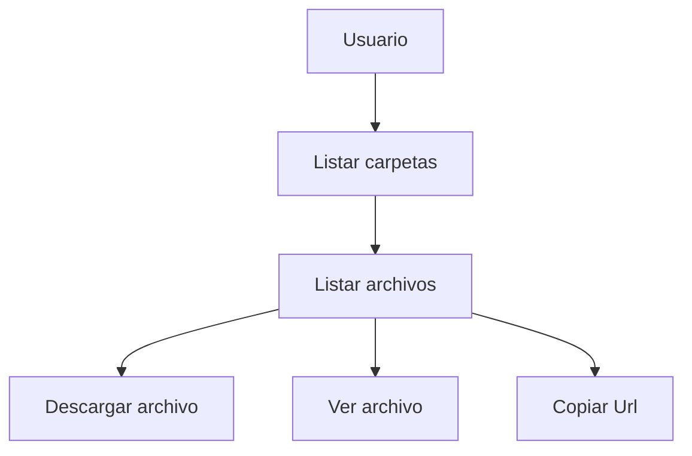

# Archivos Públicos

`cf.archivospublicos` es el primer código fuente del [**proyecto trascender**](https://github.com/jotacalderon90/), y establece la base para la gestión y distribución de recursos públicos dentro del ecosistema.

El objetivo es centralizar y publicar recursos estáticos reutilizables dentro del ecosistema de aplicaciones web.

Este repositorio actúa como una capa común de recursos públicos, incluyendo CSS, JavaScript, imágenes, librerías y documentos (PDF, MP3, MP4, DOCX, Excel, entre otros), permitiendo que múltiples aplicaciones consuman recursos de forma consistente, desacoplada y mantenible.

Está diseñado para la exposición de recursos públicos. Por definición, los archivos aquí almacenados deben ser considerados accesibles y no contener información sensible.

---

## Propósito

En lugar de duplicar archivos estáticos en cada proyecto, este servicio:

* Centraliza recursos públicos
* Reduce duplicación de código
* Facilita mantenimiento y escalabilidad del ecosistema
* Sirve como base para otras aplicaciones construidas sobre `cf.framework`

---

## Independencia de CDN externos

Una de las decisiones fundamentales de este proyecto es **no depender de CDN públicos** para la carga de recursos estáticos.

Esto responde a escenarios reales donde:

* Clientes operan en **redes locales (intranet)** sin acceso a internet
* Existen **intermitencias o caídas de conectividad**
* Se requiere **alta disponibilidad en entornos críticos**
* Hay **restricciones de seguridad** que impiden consumir recursos externos

En estos contextos, depender de CDN introduce un punto de falla externo que impacta directamente la experiencia del usuario.

Por esta razón, `cf.archivospublicos`:

* Aloja localmente todas las librerías necesarias
* Garantiza disponibilidad incluso sin conexión a internet
* Permite control total sobre archivos y dependencias
* Asegura consistencia en entornos aislados o restringidos

> La experiencia ha demostrado que los sistemas internos deben ser **autosuficientes** y no depender de servicios externos para su funcionamiento base.

---


---

## Tecnologías

### Backend

* Node.js
* Express (a través de `cf.framework`)
* Zod (validaciones)

### Frontend

* jQuery / jQuery UI
* Bootstrap 5
* Font Awesome
* Vue 3
* Summernote
* Chart.js
* Leaflet + Leaflet Draw
* Socket.IO
* Luxon

## Ejecución local

### Configuración de red local

Cada código fuente dentro del ecosistema se ejecuta como un sistema independiente, por lo que puede requerir:

* Dominio propio
* Dirección IP propia
* Aislamiento dentro de una subred local

Para entornos de desarrollo, es posible simular esta arquitectura creando una subred en la interfaz de loopback.

#### Ejemplo de subred

```
172.27.16.1/24
```

> Puedes utilizar otro rango privado según tu necesidad pero debes indicarla en el archivo .env correspondiente.

---

#### Windows

```bash
netsh interface ipv4 add address "Loopback Pseudo-Interface 1" 172.27.16.1 255.255.255.0 store=persistent
```

---

#### Linux

```bash
sudo ip addr add 172.27.16.1/24 dev lo
```

---

#### Consideraciones

* Esta configuración permite simular múltiples servicios corriendo en una misma máquina
* Facilita pruebas de integración entre sistemas desacoplados
* Evita conflictos al trabajar con dominios y puertos locales

---

### Con Node.js

En Windows puedes usar el script:

```bash
script.ini.bat
```

O manualmente:

```bash
npm install
npm install -C frontend/assets/lib
npm run dev
```

Para producción:

```bash
npm run start
```

---

### Con Docker

Modo desarrollo:

```bash
docker-compose -f docker-compose.dev.yml build
docker-compose -f docker-compose.dev.yml up
```

Modo producción:

```bash
docker-compose build
docker-compose up
```

---

## Notas

* Este repositorio está pensado para integrarse con otros servicios del ecosistema.
* No contiene lógica de negocio, solo exposición de recursos.
* Puede ser consumido por múltiples aplicaciones simultáneamente.
* Todo archivo contenido dentro de frontend/assets será expuesto directamente en la red, por lo que debe considerarse público.

## Continuidad del ecosistema

El siguiente componente del ecosistema es el sistema de cuentas:

[Partir con Sistema de cuentas](https://github.com/jotacalderon90/cf.account)